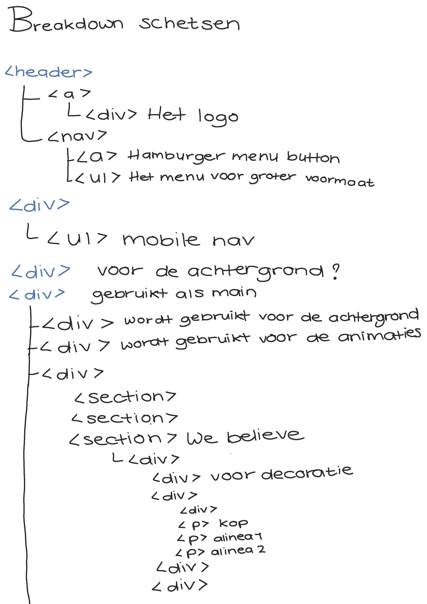
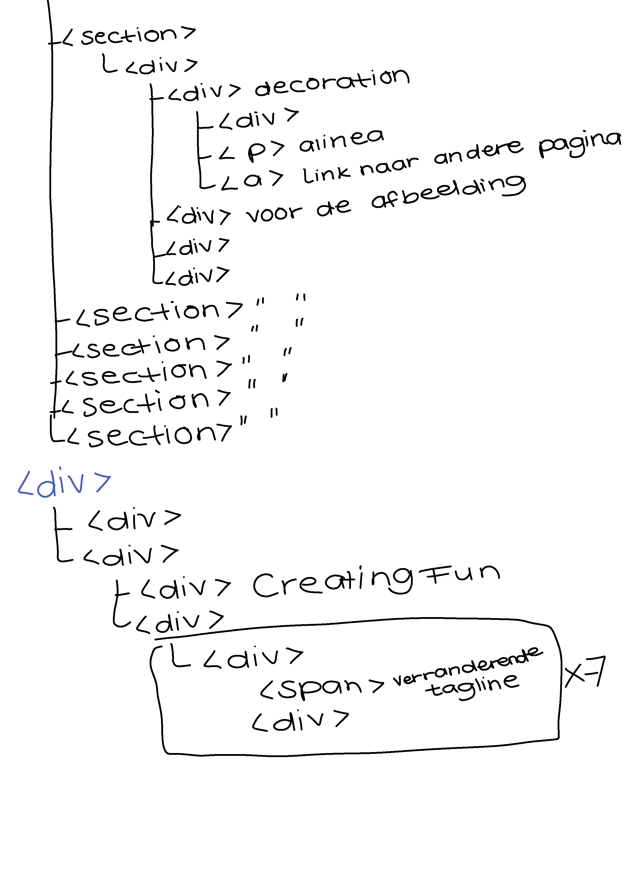
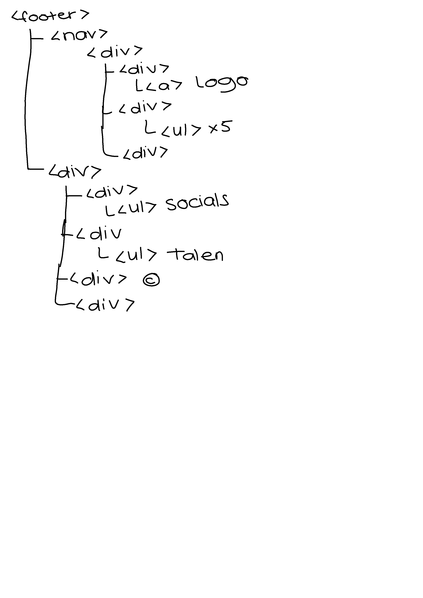

# Procesverslag
**Auteur:** Shantalla de Blaeij

Markdown cheat cheet: [Hulp bij het schrijven van Markdown](https://github.com/adam-p/markdown-here/wiki/Markdown-Cheatsheet). Nb. de standaardstructuur en de spartaanse opmaak zijn helemaal prima. Het gaat om de inhoud van je procesverslag. Besteedt de tijd voor pracht en praal aan je website.

## Bronnenlijst
1. -bron 1-
2. -bron 2-
3. -...-

## Eindgesprek (week 7/8)

-dit ging goed & dit was lastig-

**Screenshot(s):**

-screenshot(s) van je eindresultaat-

## Voortgang 3 (week 6)

-same as voortgang 1-

## Voortgang 2 (week 5)

-same as voortgang 1-

## Voortgang 1 (week 3)

### Stand van zaken

-dit ging goed & dit was lastig-

**Screenshot(s):**

-screenshot(s) van hoe ver je bent-

### Agenda voor meeting

-samen met je groepje opstellen-

### Verslag van meeting

-na afloop snel uitkomsten vastleggen-

## Intake (week 1)

**Je startniveau:** -Rode piste, doe het niet vaak en het is niet wat ik wil gaan doen. Daarintegen lukt het me meestal wel en is het dan stiekem toch wel leuk dat het lukt.-

**Je focus:** -Ik wil focussen op de surface plane. Als ik aan het einde van het blok nog voldoende tijd over heb m.b.t. andere vakken dan wil ik ook de responsivenes aanpakken. -

**Je opdracht:** -Ik weet nog niet zo goed wat ik moet kiezen maar ik heb wel een paar websites die ik super tof vind. Ik weet alleen niet of het aansluit bij wat ik kan...
	- https://www.urbaninfluence.com/work/chefn/
	- https://fourdesire.com/en/ - 

**Screenshot(s):**

**Breakdown-schets(en):**

