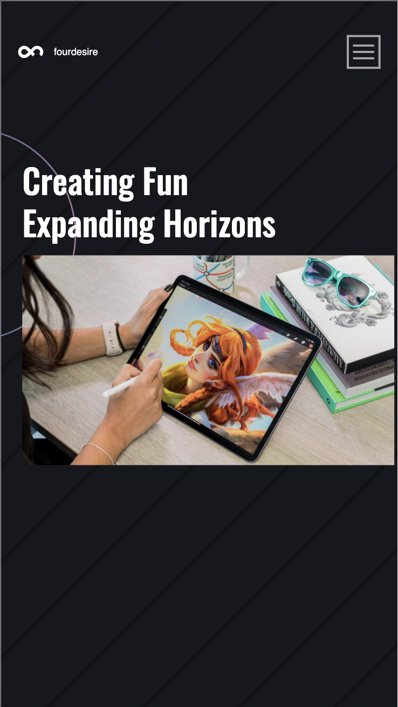
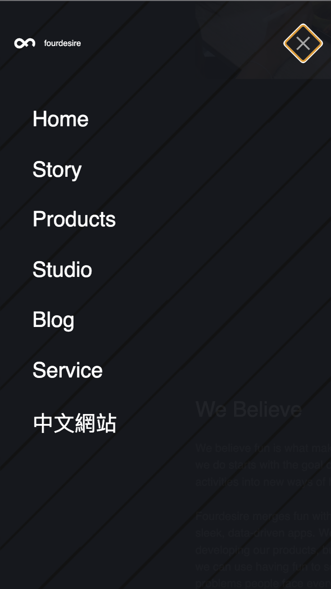
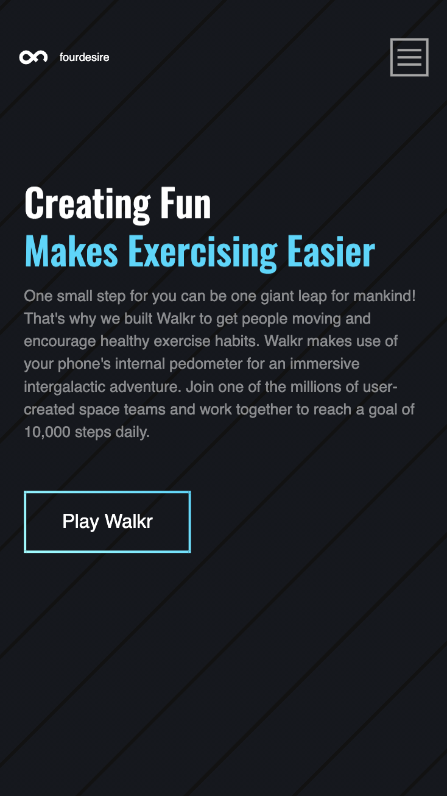
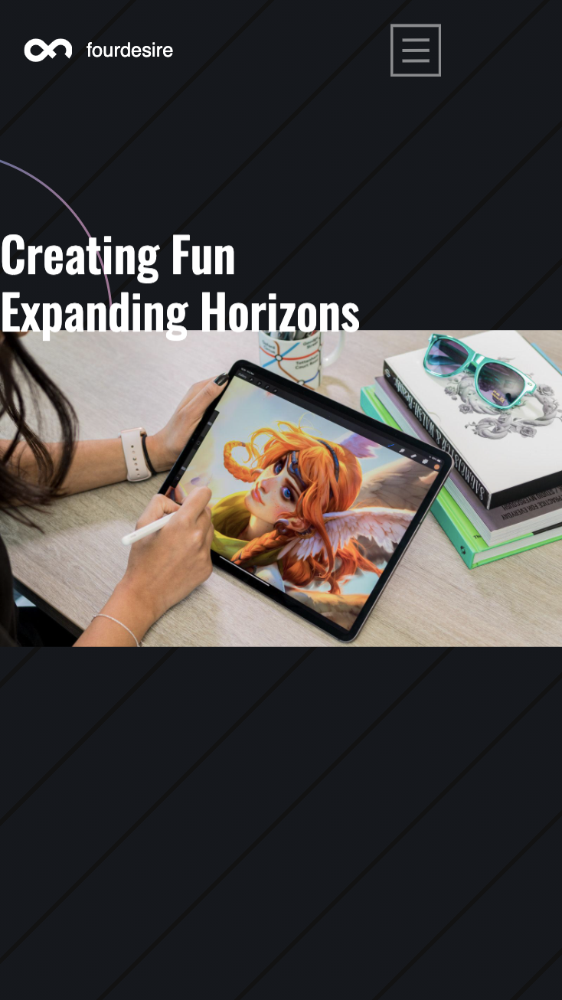
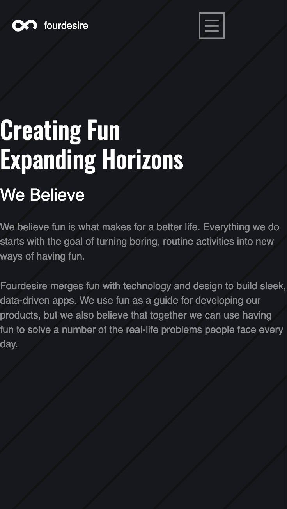
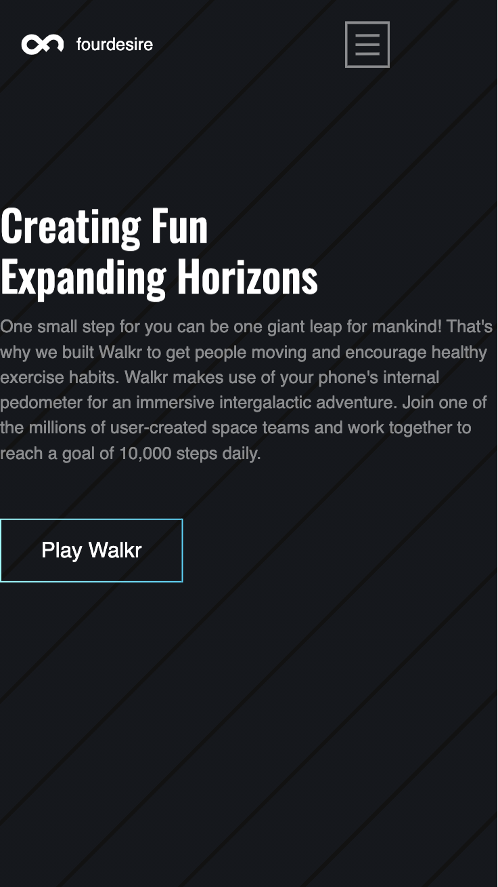
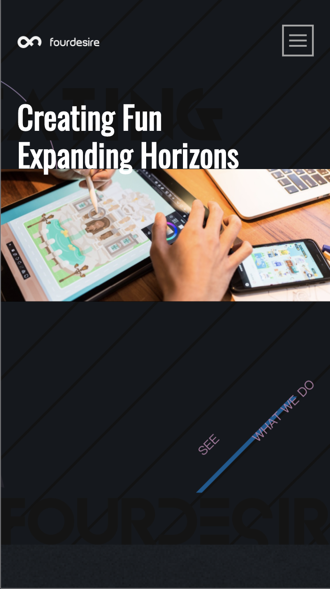
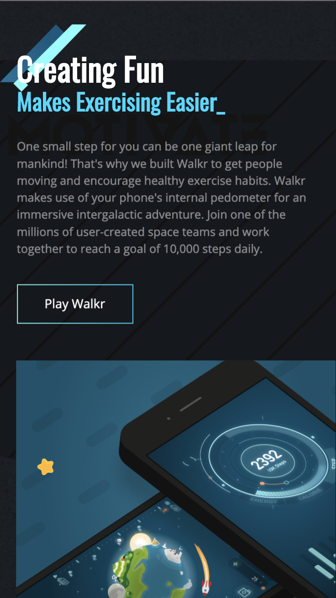
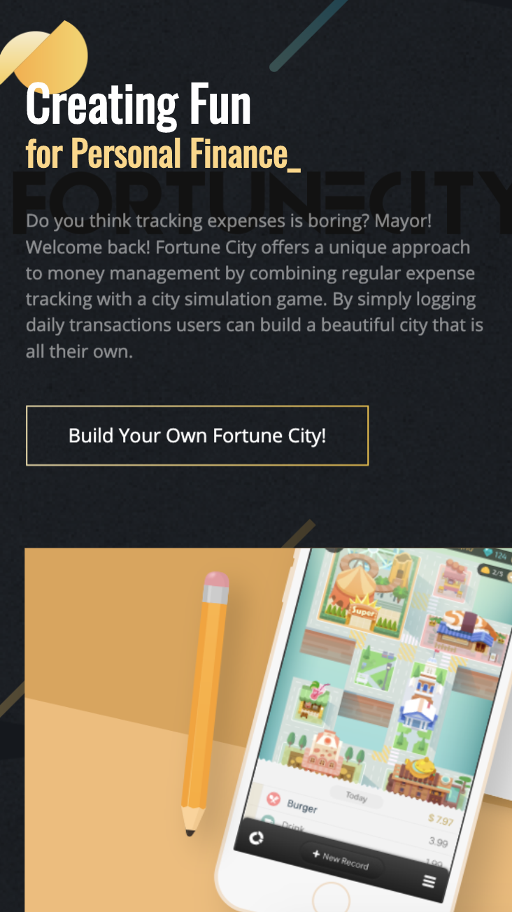
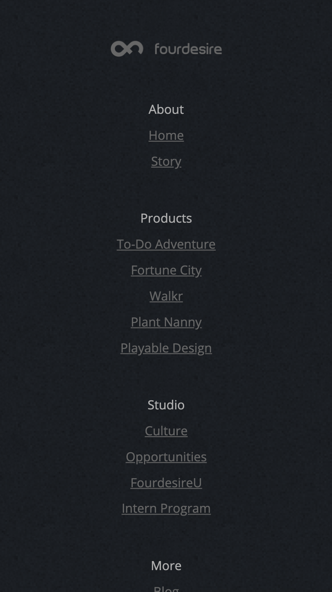

# Procesverslag
**Auteur:** Shantalla de Blaeij

## Bronnenlijst
1. https://css-tricks.com/stripes-css/ Voor de achtergrond
2. https://codepen.io/erikterwan/pen/EVzeRP Voor de hamburger menu
3. https://gomakethings.com/how-to-test-if-an-element-is-in-the-viewport-with-vanilla-javascript/ Voor het in en uitvliegen van de h2'tjes

## Eindgesprek (week 7/8)

- Ik vond het leuk om de visual effect te kunnen programmeren. Verder vindt ik het responsive maken wel erg lastig. En ik vond het erg lastig om in te schatten hoe hoog je de lat voor jezelf moest leggen. In het begin van het val vond ik het allemaal een beetje makkelijk en saai,de theorie snapte ik allemaal maar om dan alles samen toe te passen in een website vind ik lastig.

**Screenshot(s):**

--

## Voortgang 3 (week 6)

Alles loopt wel soepeltjes. Moet voor mn gevoel wel nog veel doen!! Zoals het responsive maken van de artikels. EN nog veel meer toevoegen aan de surface plane.

## Voortgang 2 (week 5)

### Stand van zaken

- De meeste opdrachten gingen wel soepel, heb nog beetje moeite met grid maar dat komt meer omdat ik het nog niet zoveel heb toegepast dus niet helemaal weet hoe het werkt. Over mn website ben ik al wel redelijk tevreden, de meeste dingen zijn me al wel gelukt, nu alleen zorgen dat de website beetje responsive is en meer focussen op de surface plane. -

**Screenshot(s):**

### Agenda voor meeting

-

### Verslag van meeting

## Voortgang 1 (week 3)

### Stand van zaken

-Alle opdrachten die we kregen voor de les gingen wel soepel. Af en toe met enige opstakel door iets verkeerd te schrijven of iets bij het verkeerde element te zetten. De website heb ik nu ook een beginnetje aan gemaakt en gaat ook wel redelijk. Ik vind het alleen lastig om het echt al helemaal na te maken met HTML/CSS. -

**Screenshot(s):**

### Agenda voor meeting

- Maken van menu bespreken

### Verslag van meeting

- Nog veel te doen voor mijzelf

## Intake (week 1)

**Je startniveau:** -Rode piste, doe het niet vaak en het is niet wat ik wil gaan doen. Daarintegen lukt het me meestal wel en is het dan stiekem toch wel leuk dat het lukt.-

**Je focus:** -Ik wil focussen op de surface plane. Als ik aan het einde van het blok nog voldoende tijd over heb m.b.t. andere vakken dan wil ik ook de responsivenes aanpakken. -

**Je opdracht:** -Ik ga voor de website Fourdesire (https://fourdesire.com/en/). Ik zou het super vet vinden als ik dit visueel kan na maken. Inclusief met de bewegende onderdelen. 

**Screenshot(s):**

**Breakdown-schets(en):**

